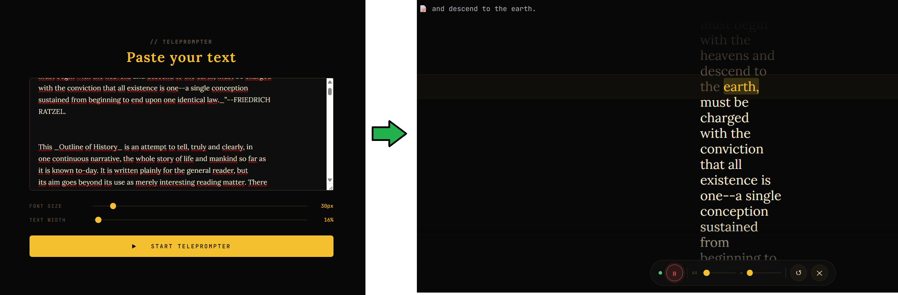

# Teleprompter

A voice-driven teleprompter that highlights text in real time using on-device speech recognition via Whisper AI.

---

## Features

- Real-time speech-to-text with Whisper (runs entirely in the browser)
- Auto-scroll synchronized to your voice
- Adjustable font size, text width, line height and scroll speed
- Multilingual support — English, Spanish and more
- Works offline after the first model download

## Tech Stack

- Vanilla JS + Web Audio API + MediaRecorder API
- [Transformers.js](https://github.com/xenova/transformers.js) — Whisper inference in-browser via Web Worker
- Node.js + Express (static file server)

## Getting Started

```bash
npm install
node server.js
```

Open [http://localhost:3000](http://localhost:3000) in your browser.

> On first launch the Whisper model (~150MB) will be downloaded and cached automatically.

## Project Structure

```
teleprompter/
├── public/
│   ├── index.html
│   ├── whisper-worker.js
│   ├── screenshot.png
│   ├── css/
│   │   ├── base.css		# CSS variables, reset, shared styles
│   │   ├── setup.css		# Setup screen styles
│   │   └── prompter.css	# Prompter screen styles
│   └── js/
│       ├── main.js			# UI event listeners
│       └── prompter.js		# Engine: state, audio, Whisper, scroll
├── server.js
├── package.json
├── package-lock.json
├── .gitignore
├── README.md
└── LICENCE
```

## Built With

Developed in pair programming with [Claude Sonnet 4.6](https://claude.ai) (Anthropic).
